# Diagrama de Clases - Banco del Austro

```mermaid
classDiagram
    %% Resources Layer
    class TestResource {
        -ConcatenationRequestProcessor processor
        +concatenateParams(param1, param2, param3, param4, param5) Response
    }
    
    class PokemonResource {
        -PokemonService pokemonService
        -Logger LOG
        +getMoves(strategy, headers) Response
    }
    
    %% Processor Layer (Template Method Pattern)
    class RequestProcessor {
        <<abstract>>
        +processRequest(params) Response
        #preValidate(params) boolean
        #executeBusinessLogic(params) ServiceResult
        #createSuccessResponse(data) Response
        #createErrorResponse(message) Response
    }
    
    class ConcatenationRequestProcessor {
        -ConcatenationService concatenationService
        -NullBlankValidationStrategy nullBlankValidator
        -SqlInjectionValidationStrategy sqlInjectionValidator
        +preValidate(params) boolean
        +executeBusinessLogic(params) ServiceResult
        +createSuccessResponse(data) Response
        +createErrorResponse(message) Response
    }
    
    %% Service Layer
    class ConcatenationService {
        -SanitizerFactory sanitizerFactory
        -Event~ConcatenationEvent~ concatenationEvent
        +processAndConcatenate(params, validators) ServiceResult~String~
    }
    
    class PokemonService {
        -FaultToleranceFactory faultToleranceFactory
        -Event~PokemonApiEvent~ pokemonApiEvent
        -Logger LOG
        +getMoves(strategy) ServiceResult~MoveResponse~
        +getMoves(strategy, fromScheduler) ServiceResult~MoveResponse~
        -getStrategy(strategy) FaultToleranceStrategy
    }
    
    %% Validation Layer (Strategy Pattern)
    class ValidationStrategy {
        <<interface>>
        +validate(input) ValidationResult
    }
    
    class NullBlankValidationStrategy {
        +validate(input) ValidationResult
    }
    
    class SqlInjectionValidationStrategy {
        -String[] SQL_KEYWORDS
        +validate(input) ValidationResult
    }
    
    class ValidationResult {
        -boolean valid
        -String message
        +success() ValidationResult
        +failure(message) ValidationResult
        +isValid() boolean
        +getMessage() String
    }
    
    %% Sanitizer Layer (Factory Pattern)
    class InputSanitizer {
        <<interface>>
        +sanitize(input) String
    }
    
    class SqlInjectionSanitizer {
        +sanitize(input) String
    }
    
    class SanitizerFactory {
        -SqlInjectionSanitizer sqlInjectionSanitizer
        +getSqlInjectionSanitizer() InputSanitizer
    }
    
    %% Fault Tolerance Layer (Strategy Pattern)
    class FaultToleranceStrategy {
        <<interface>>
        +execute() MoveResponse
    }
    
    class RetryStrategy {
        -PokemonApiClient pokemonApiClient
        +execute() MoveResponse
    }
    
    class CircuitBreakerStrategy {
        -PokemonApiClient pokemonApiClient
        +execute() MoveResponse
        +fallbackResponse() MoveResponse
    }
    
    class FaultToleranceFactory {
        -RetryStrategy retryStrategy
        -CircuitBreakerStrategy circuitBreakerStrategy
        +getRetryStrategy() FaultToleranceStrategy
        +getCircuitBreakerStrategy() FaultToleranceStrategy
    }
    
    %% Client Layer
    class PokemonApiClient {
        <<interface>>
        +getMoves() MoveResponse
    }
    
    %% Response Builder (Builder Pattern)
    class ResponseBuilder {
        -int status
        -String entity
        +create() ResponseBuilder
        +success(data) ResponseBuilder
        +badRequest(message) ResponseBuilder
        +build() Response
    }
    
    %% DTOs
    class ServiceResult~T~ {
        -boolean success
        -T data
        -String errorMessage
        +success(data) ServiceResult~T~
        +failure(errorMessage) ServiceResult~T~
        +isSuccess() boolean
        +getData() T
        +getErrorMessage() String
    }
    
    class MoveResponse {
        -int count
        -String next
        -String previous
        -List~MoveResult~ results
    }
    
    %% Events (Observer Pattern)
    class ConcatenationEvent {
        -List~String~ parameters
        -String result
        -boolean success
        -String errorMessage
        -LocalDateTime timestamp
        -String validationStrategy
        +success(params, result, strategy) ConcatenationEvent
        +failure(params, error, strategy) ConcatenationEvent
    }
    
    class PokemonApiEvent {
        -String faultToleranceStrategy
        -int movesCount
        -boolean success
        -String errorMessage
        -LocalDateTime timestamp
        -long responseTime
        -boolean fromScheduler
        +success(strategy, count, time, scheduler) PokemonApiEvent
        +failure(strategy, error, time, scheduler) PokemonApiEvent
    }
    
    class EventListener {
        -Logger LOG
        +onConcatenationEvent(event) void
        +onPokemonApiEvent(event) void
    }
    
    %% Interceptor (AOP)
    class LoggingInterceptor {
        -Logger LOG
        +logExecution(context) Object
    }
    
    class Logged {
        <<annotation>>
    }
    
    %% Scheduler
    class PokemonScheduler {
        -PokemonService pokemonService
        -String defaultStrategy
        -Logger LOG
        +scheduledPokemonCall() void
    }
    
    %% Relationships
    TestResource --> ConcatenationRequestProcessor
    PokemonResource --> PokemonService
    
    ConcatenationRequestProcessor --|> RequestProcessor
    ConcatenationRequestProcessor --> ConcatenationService
    ConcatenationRequestProcessor --> ValidationStrategy
    ConcatenationRequestProcessor --> ResponseBuilder
    
    ConcatenationService --> SanitizerFactory
    ConcatenationService --> ValidationStrategy
    ConcatenationService --> ConcatenationEvent
    
    PokemonService --> FaultToleranceFactory
    PokemonService --> PokemonApiEvent
    
    NullBlankValidationStrategy ..|> ValidationStrategy
    SqlInjectionValidationStrategy ..|> ValidationStrategy
    
    SqlInjectionSanitizer ..|> InputSanitizer
    SanitizerFactory --> SqlInjectionSanitizer
    
    RetryStrategy ..|> FaultToleranceStrategy
    CircuitBreakerStrategy ..|> FaultToleranceStrategy
    RetryStrategy --> PokemonApiClient
    CircuitBreakerStrategy --> PokemonApiClient
    FaultToleranceFactory --> RetryStrategy
    FaultToleranceFactory --> CircuitBreakerStrategy
    
    EventListener --> ConcatenationEvent
    EventListener --> PokemonApiEvent
    
    LoggingInterceptor --> Logged
    ConcatenationService --> Logged
    PokemonService --> Logged
    
    PokemonScheduler --> PokemonService
```

## Patrones de Diseño Implementados

### 1. **Strategy Pattern**
- **Validaciones**: `ValidationStrategy`, `NullBlankValidationStrategy`, `SqlInjectionValidationStrategy`
- **Tolerancia a Fallos**: `FaultToleranceStrategy`, `RetryStrategy`, `CircuitBreakerStrategy`

### 2. **Factory Pattern**
- **Sanitizadores**: `SanitizerFactory`
- **Tolerancia a Fallos**: `FaultToleranceFactory`

### 3. **Builder Pattern**
- **Respuestas HTTP**: `ResponseBuilder`

### 4. **Template Method Pattern**
- **Procesamiento de Requests**: `RequestProcessor`, `ConcatenationRequestProcessor`

### 5. **Observer Pattern**
- **Eventos**: `ConcatenationEvent`, `PokemonApiEvent`, `EventListener`

### 6. **Service Layer Pattern**
- **Lógica de Negocio**: `ConcatenationService`, `PokemonService`

### 7. **Interceptor Pattern (AOP)**
- **Logging**: `LoggingInterceptor`, `@Logged`

## Capas de la Arquitectura

1. **Resource Layer**: Endpoints REST (`TestResource`, `PokemonResource`)
2. **Processor Layer**: Procesamiento de requests (`RequestProcessor`)
3. **Service Layer**: Lógica de negocio (`ConcatenationService`, `PokemonService`)
4. **Validation Layer**: Validaciones (`ValidationStrategy` implementations)
5. **Client Layer**: Clientes externos (`PokemonApiClient`)
6. **Event Layer**: Manejo de eventos (`EventListener`)
7. **Infrastructure Layer**: Interceptores, Schedulers